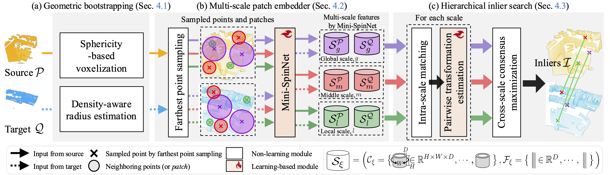

<div align="center">
    <h1>BUFFER-X</h1>
    <p align="center">
      <a href="https://scholar.google.com/citations?user=esoiHnYAAAAJ&hl=en">Minkyun Seo*</a>,
      <a href="https://scholar.google.com/citations?user=S1A3nbIAAAAJ&hl=en">Hyungtae Lim*</a>,
      <a href="https://scholar.google.com/citations?user=s-haNkwAAAAJ&hl=en">Kanghee Lee</a>,
      <a href="https://scholar.google.com/citations?user=U4kKRdMAAAAJ&hl=it">Luca Carlone</a>,
      <a href="https://scholar.google.com/citations?user=_3q6KBIAAAAJ&hl=en">Jaesik Park</a>
      <br />
    </p>
    <a href="https://github.com/MIT-SPARK/BUFFER-X"></a>
    <a href="https://github.com/MIT-SPARK/BUFFER-X"></a>
    <a href="https://arxiv.org/abs/2503.07940"></a>
    <a href="https://creativecommons.org/licenses/by-nc-sa/4.0/legalcode"></a>
  <br />
  <br />
  <p align="center"></p>
  <p><strong><em>Towards zero-shot and beyond! 🚀 <br>
  Official repository of BUFFER-X, a zero-shot point cloud registration method<br> across diverse scenes without retraining or tuning.</em></strong></p>
</div>

______________________________________________________________________

## 🧭 Structure Overview



## 💻 Installation of BUFFER-X

#### Set up environment

Make sure the basic packages are installed by using this command:

```
sudo apt-get install -y gcc g++ build-essential python3-pip python3-dev cmake git ninja-build unzip
```

This code has been tested with Python 3.8, Pytorch 1.9.1, CUDA 11.1 on Ubuntu 22.04.

- Clone the repository

```
git clone https://github.com/MIT-SPARK/BUFFER-X && cd BUFFER-X
```

- Setup conda virtual environment

```
conda create -n bufferx python=3.8
source activate bufferx
pip install torch==1.9.1+cu111 torchvision==0.10.1+cu111 torchaudio==0.9.1 -f https://download.pytorch.org/whl/torch_stable.html
pip install open3d==0.13.0

export CUDA_HOME=/your/cuda/home/directory/
pip install "git+git://github.com/erikwijmans/Pointnet2_PyTorch.git#egg=pointnet2_ops&subdirectory=pointnet2_ops_lib"
pip install --upgrade https://github.com/unlimblue/KNN_CUDA/releases/download/0.2/KNN_CUDA-0.2-py3-none-any.whl
pip install ninja kornia einops easydict tensorboard tensorboardX
pip install nibabel -i http://pypi.douban.com/simple --trusted-host pypi.douban.com
cd cpp_wrappers && sh compile_wrappers.sh && cd ..
git clone https://github.com/KinglittleQ/torch-batch-svd.git && cd torch-batch-svd && python setup.py install && cd .. && sudo rm -rf torch-batch-svd/
```

#### Datasets

Due to the large number and variety of datasets used in our experiments, we provide detailed download instructions and folder structures in a separate document:

[DATASETS.md](dataset/DATASETS.md)

## 🚀 Quick Start

### Training and Testing

#### Training

BUFFER-X supports training on either the **3DMatch** or **KITTI** dataset. As un example, run the following command to train the model:

```
python train.py --dataset 3DMatch
```

______________________________________________________________________

#### Testing

First, download the model using the following script:

```
./scripts/download_pretrained_models.sh
```

<details>
  <summary><strong>Detailed explanation about file directory</a></strong></summary>

The structure should be as follows:

- `BUFFER-X`
  - `snapshot` # \<- this directory is generated by the command above
    - `threedmatch`
      - `Desc`
      - `Pose`
    - `kitti`
      - `Desc`
      - `Pose`
  - `config`
  - `dataset`
  - ...

</details>

Next, to evaluate **BUFFER-X** in diverse scenes, please download the preprocessed data by running the following command. it requires around 130 GB.
However, to include all other datasets (i.e., `KITTI`, `Scannetpp_iphone`, `Scannetpp_faro`), it requires approximately 150 GB more.

```
./scripts/download_all_data.sh

```

Then, you can run the below command as follows:

```
python test.py --dataset <LIST OF DATASET NAMES>
```

e.g.,

```
python test.py --dataset 3DMatch TIERS Oxford MIT
```

<details>
  <summary><strong>Detailed explanation about configuration</a></strong></summary>

- `--dataset`: The name of the dataset to test on. Must be one of:

  - `3DMatch`
  - `3DLoMatch`
  - `Scannetpp_iphone`
  - `Scannetpp_faro`
  - `TIERS`
  - `KITTI`
  - `WOD`
  - `MIT`
  - `KAIST`
  - `ETH`
  - `Oxford`

- `--experiment_id`: The ID of the experiment to use for testing.

</details>

______________________________________________________________________

### 📝 Citation

If you find our work useful in your research, please consider citing:

```
@article{Seo_BUFFERX_arXiv_2025,
Title={BUFFER-X: Towards Zero-Shot Point Cloud Registration in Diverse Scenes},
Author={Minkyun Seo and Hyungtae Lim and Kanghee Lee and Luca Carlone and Jaesik Park},
Journal={2503.07940 (arXiv)},
Year={2025}
}
```

______________________________________________________________________

## 🙏 Acknowledgements

This work was supported by IITP grant (RS-2021-II211343: AI Graduate School Program at Seoul National University) (5%), and by NRF grants funded by the Korea government (MSIT) (No. 2023R1A1C200781211 (65%) and No. RS-2024-00461409 (30%), respectively).

In addition, we appreciate the open-source contributions of previous authors,
and especially thank [Sheng Ao](https://scholar.google.com/citations?user=cvS1yuMAAAAJ&hl=zh-CN), the first author of [BUFFER](https://github.com/SYSU-SAIL/BUFFER),
for allowing us to use the term 'BUFFER' as part of the title of our study.

- [FCGF](https://github.com/chrischoy/FCGF)
- [Vector Neurons](https://github.com/FlyingGiraffe/vnn)
- [D3Feat](https://github.com/XuyangBai/D3Feat.pytorch)
- [PointDSC](https://github.com/XuyangBai/PointDSC)
- [SpinNet](https://github.com/QingyongHu/SpinNet)
- [GeoTransformer](https://github.com/qinzheng93/GeoTransformer)
- [RoReg](https://github.com/HpWang-whu/RoReg)
- [BUFFER](https://github.com/SYSU-SAIL/BUFFER)

______________________________________________________________________

### Updates

- 25/06/2025: This paper has been accepted by ICCV 2025!
