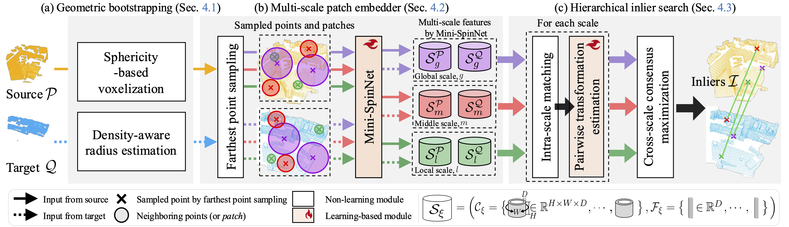

<div align="center">
    <h1>BUFFER-X (ICCV 2025, 🌟Highlight🌟)</h1>
    <p align="center">
      <a href="https://scholar.google.com/citations?user=esoiHnYAAAAJ&hl=en">Minkyun Seo*</a>,
      <a href="https://scholar.google.com/citations?user=S1A3nbIAAAAJ&hl=en">Hyungtae Lim*</a>,
      <a href="https://scholar.google.com/citations?user=s-haNkwAAAAJ&hl=en">Kanghee Lee</a>,
      <a href="https://scholar.google.com/citations?user=U4kKRdMAAAAJ&hl=it">Luca Carlone</a>,
      <a href="https://scholar.google.com/citations?user=_3q6KBIAAAAJ&hl=en">Jaesik Park</a>
      <br />
    </p>
    <a href="https://github.com/MIT-SPARK/BUFFER-X"></a>
    <a href="https://github.com/MIT-SPARK/BUFFER-X"></a>
    <a href="https://arxiv.org/abs/2503.07940">
    
    </a>
    <a href="https://arxiv.org/abs/2601.02759">
    
    </a>
    <a href="https://creativecommons.org/licenses/by-nc-sa/4.0/legalcode"></a>
    <a href="huggingface/model_card/README.md"></a>
  <br />
  <br />
  <p align="center"></p>
  <p><strong><em>Towards zero-shot and beyond! 🚀 <br>
  Official repository of BUFFER-X, a zero-shot point cloud registration method<br> across diverse scenes without retraining or tuning.</em></strong></p>
</div>

________________________________

## 🧭 Structure Overview



## 💻 Installation of BUFFER-X

#### Set up environment

After cloning this repository:

```
git clone https://github.com/MIT-SPARK/BUFFER-X && cd BUFFER-X
```

#### Recommended quick install

For a fresh Ubuntu + CUDA environment, use the unified installer:

```bash
conda create -n bufferx python=3.11 -y
conda activate bufferx
./scripts/install.sh --cuda cu124 --with-hub
```

Supported installer targets:

- `--cuda cu124`: PyTorch CUDA 12.4 wheels (recommended for current CUDA 12 systems)
- `--cuda cu118`: PyTorch CUDA 11.8 wheels
- `--cuda cu111`: legacy PyTorch 1.9.1 + CUDA 11.1 path
- `--cuda cpu --skip-cuda-extensions`: metadata/utilities only; full inference still requires CUDA extensions

Useful optional flags:

- `--with-hub`: install Hugging Face upload/download helpers
- `--with-kiss`: install optional KISS-Matcher support
- `--with-scannetpp`: install ScanNet++ preprocessing dependencies
- `--no-apt`: skip system package installation when your Docker image already has build tools

If you prefer manual control, `pip install -e '.[runtime]'` installs the pure-Python runtime dependencies. PyTorch and CUDA extensions should still be installed with the script above because their wheels depend on your CUDA stack. For Hugging Face upload/download helpers only, use `pip install -e '.[hub]'`.

Setup your **own virtual environment** (e.g., `conda create -n bufferx python=3.x` or setting your Nvidia Docker env.) and then install the required libraries. We present some shellscripts as follows.

**\[Python 3.8, Pytorch 1.9.1, CUDA 11.1 on Ubuntu 22.04\]**

```
./scripts/install_py3_8_cuda11_1.sh
```

**\[Python 3.10, Pytorch 2.7.1, CUDA 11.8, Cudnn 9.1.0 on Ubuntu 24.04\]**

```
./scripts/install_py3_10_cuda11_8.sh
```

**\[Python 3.11, Pytorch 2.6.0, CUDA 12.4, Cudnn 9.1.0 on Ubuntu 24.04\]**

```
./scripts/install_py3_11_cuda12_4.sh
```

______________________________________________________________________

## 🚀 Quick Start

### Training and Test

#### Test on Our Generalization Benchmark

You can easily run our **generalization benchmark** with BUFFER-X. First, download the model using the following script:

```
./scripts/download_pretrained_models.sh
```

By default this keeps the original Dropbox source. If the pretrained snapshots have been uploaded to Hugging Face, download them from the model repository instead:

```bash
python scripts/download_pretrained_models.py --source hf --repo-id <HF_ORG_OR_USER>/BUFFER-X
```

<details>
  <summary><strong>Detailed explanation about file directory</a></strong></summary>

The structure should be as follows:

- `BUFFER-X`
  - `snapshot` # \<- this directory is generated by the command above
    - `threedmatch`
      - `Desc`
      - `Pose`
    - `kitti`
      - `Desc`
      - `Pose`
  - `config`
  - `dataset`
  - ...

</details>
<br>

Next, to evaluate **BUFFER-X** in diverse scenes, please download the preprocessed data by running the following command. It requires around 130 GB.
However, to include all other datasets (i.e., `Scannetpp_iphone`, `Scannetpp_faro`), approximately 150 GB more storage is required.
Due to the data copyrights, we cannot provide preprocessed data for ScanNet++, so if you want to reproduce whole results, please refer to [here](dataset/README.md)

```
./scripts/download_all_data.sh
```

Then, you can run the below command as follows:

```
python test.py --dataset <LIST OF DATASET NAMES> --experiment_id <EXPERIMENT ID> --verbose
```

Experiment ID refers to the saved model’s filename. Provided snapshots include `threedmatch` and `kitti`, each trained on the corresponding dataset.

e.g.,

```
python test.py --dataset 3DMatch TIERS Oxford MIT --experiment_id threedmatch --verbose
```

You can also run the evaluation script for all datasets at once by using the provided script:

```
./scripts/eval_all.sh <EXPERIMENT ID>
```

For heterogeneous evaluation settings introduced in the extended version, use:

```
./scripts/eval_all_hetero.sh <EXPERIMENT ID>
```

<details>
  <summary><strong>Detailed explanation about configuration</a></strong></summary>

- `--dataset`: The name of the dataset to test on. Must be one of:

  - `3DMatch`
  - `3DLoMatch`
  - `Scannetpp_iphone`
  - `Scannetpp_faro`
  - `TIERS`
  - `KITTI`
  - `WOD`
  - `MIT`
  - `KAIST`
  - `ETH`
  - `Oxford`
  - `TIERS_hetero`
  - `KAIST_hetero`

- `--experiment_id`: The ID of the experiment to use for testing.

- `--pose_estimator`: Pose estimation backend. Choices: `ransac` (default) or `kiss_matcher`.

- `--gpu`: GPU device index to use (default: `0`).

- `--num_points_per_patch`, `--num_scales`, `--num_fps`, `--search_radius_thresholds`: Override the corresponding config values for ablation studies.

For heterogeneous evaluation, additional arguments are:
- `--src_sensor`: Source sensor name (e.g., `os0_128`, `Aeva`).
- `--tgt_sensor`: Target sensor name (e.g., `os1_64`, `Avia`).

e.g.,

```
python test.py --dataset TIERS_hetero --src_sensor os0_128 --tgt_sensor os1_64 --experiment_id threedmatch --verbose
```


Due to the large number and variety of datasets used in our experiments, we provide detailed download instructions and folder structures in a separate document:

[dataset/README.md](dataset/README.md)

</details>
<br>

______________________________________________________________________

## 🤗 Hugging Face Release

This repository includes Hugging Face-ready files for a model repository and a lightweight Space helper:

- `huggingface/model_card/README.md`: model card template for the pretrained weights
- `huggingface/space/`: Docker Space scaffold that checks the model repo layout and generates install commands
- `scripts/upload_to_huggingface.py`: upload helper for model and Space repos

Prepare your local snapshots first:

```bash
./scripts/download_pretrained_models.sh
```

Then authenticate and upload:

```bash
pip install -e '.[hub]'
hf auth login
python scripts/upload_to_huggingface.py \
  --model-repo-id <HF_ORG_OR_USER>/BUFFER-X \
  --space-repo-id <HF_ORG_OR_USER>/buffer-x-hub-helper
```

Before uploading, you can preview what will be sent:

```bash
python scripts/upload_to_huggingface.py \
  --model-repo-id <HF_ORG_OR_USER>/BUFFER-X \
  --space-repo-id <HF_ORG_OR_USER>/buffer-x-hub-helper \
  --dry-run
```

The model repo expects the same snapshot layout used locally:

```text
snapshot/
  threedmatch/
    Desc/best.pth
    Pose/best.pth
  kitti/
    Desc/best.pth
    Pose/best.pth
```

The full BUFFER-X inference path requires CUDA extensions, so the included Space is intentionally a reliable CPU-only hub helper. A GPU inference Space can be added on top of the same Docker scaffold after finalizing a public point-cloud upload format.

<details>
  <summary><strong>Example: Download pretrained weights from Hugging Face</strong></summary>

Use this when you want to run BUFFER-X from a Hugging Face model repository instead of the default Dropbox snapshot link.

```bash
git clone https://github.com/MIT-SPARK/BUFFER-X
cd BUFFER-X

conda create -n bufferx python=3.11 -y
conda activate bufferx

./scripts/install.sh --cuda cu124 --with-hub
python scripts/download_pretrained_models.py \
  --source hf \
  --repo-id Hyungtae-Lim/BUFFER-X
```

After this, `snapshot/` should contain:

```text
snapshot/
  threedmatch/Desc/best.pth
  threedmatch/Pose/best.pth
  kitti/Desc/best.pth
  kitti/Pose/best.pth
```

</details>

<details>
  <summary><strong>Example: Evaluate with Hugging Face weights</strong></summary>

After installing dependencies, downloading the Hugging Face weights, and preparing datasets, run:

```bash
python test.py \
  --dataset 3DMatch TIERS Oxford MIT \
  --experiment_id threedmatch \
  --verbose
```

For KITTI-trained weights:

```bash
python test.py \
  --dataset KITTI WOD KAIST Oxford \
  --experiment_id kitti \
  --verbose
```

For heterogeneous evaluation:

```bash
python test.py \
  --dataset TIERS_hetero \
  --src_sensor os0_128 \
  --tgt_sensor os1_64 \
  --experiment_id threedmatch \
  --verbose
```

</details>

<details>
  <summary><strong>Example: Upload your own BUFFER-X release to Hugging Face</strong></summary>

Do not paste your Hugging Face token into issues, pull requests, notebooks, or chat logs. Log in locally:

```bash
pip install -e '.[hub]'
hf auth login
```

Prepare the local pretrained snapshots:

```bash
./scripts/download_pretrained_models.sh
```

Preview the upload:

```bash
python scripts/upload_to_huggingface.py \
  --model-repo-id <HF_ORG_OR_USER>/BUFFER-X \
  --space-repo-id <HF_ORG_OR_USER>/buffer-x-hub-helper \
  --dry-run
```

Upload the model card, snapshots, and Space helper:

```bash
python scripts/upload_to_huggingface.py \
  --model-repo-id <HF_ORG_OR_USER>/BUFFER-X \
  --space-repo-id <HF_ORG_OR_USER>/buffer-x-hub-helper
```

</details>

<details>
  <summary><strong>Example: Use only the lightweight Hugging Face Space helper</strong></summary>

The included Space helper is CPU-only. It verifies that the model repo has the expected snapshot files and generates installation commands for users.

```bash
python scripts/upload_to_huggingface.py \
  --model-repo-id Hyungtae-Lim/BUFFER-X \
  --space-repo-id Hyungtae-Lim/buffer-x-hub-helper
```

Then open the Space URL:

```text
https://huggingface.co/spaces/Hyungtae-Lim/buffer-x-hub-helper
```

</details>

______________________________________________________________________

### Using KISS-Matcher as the Pose Solver

This branch adds support for [KISS-Matcher](https://github.com/MIT-SPARK/KISS-Matcher) as an alternative to RANSAC for the final pose estimation step.

#### Installation

Please follow the official Python installation instructions provided in the KISS-Matcher repository:
https://github.com/MIT-SPARK/KISS-Matcher?tab=readme-ov-file#package-installation

#### Usage

Pass `--pose_estimator kiss_matcher` on the command line:

```bash
python test.py --dataset 3DMatch --experiment_id threedmatch --pose_estimator kiss_matcher --verbose
```

To use RANSAC (default behavior):

```bash
python test.py --dataset 3DMatch --experiment_id threedmatch --pose_estimator ransac --verbose
```

#### Configuration

You can also set the pose estimator and its options directly in the config files (e.g., `config/indoor_config.py`):

```python
cfg.match.pose_estimator = "kiss_matcher"  # "ransac" or "kiss_matcher"
cfg.match.kiss_resolution = 0.3            # Voxel resolution for KISS-Matcher
```

> **Note:** If `kiss-matcher` is not installed, the pipeline automatically falls back to RANSAC with a warning.

______________________________________________________________________

### Early Exit (Confidence-Aware Multi-Scale Processing)

BUFFER-X++ introduces an **incremental multi-scale processing** strategy that stops computing additional scales once the pose estimate is already confident enough. This reduces unnecessary descriptor extraction and speeds up inference.

The early exit is triggered when the number of RANSAC/KISS-Matcher inliers exceeds `early_exit_min_inliers` after the first scale.

#### Configuration

```python
cfg.match.enable_early_exit = False   # Enable confidence-aware early exit (default: False)
cfg.match.early_exit_min_inliers = 50  # Minimum inlier count to trigger early exit
```
______________________________________________________________________

### Output Files

After each test run, results are automatically saved:

- **Per-sample `.txt`**: detailed per-frame metrics (success, RTE, RRE, inlier counts, timing) under `per_sample_results/<exp_name>/`.
- **Summary `.csv`**: aggregated statistics (recall, RTE/RRE mean ± std, timing) saved to the root directory as `full_results/results_<exp_name>_<params>_<timestamp>.csv`.

______________________________________________________________________

#### Training

BUFFER-X supports training on either the **3DMatch** or **KITTI** dataset. As un example, run the following command to train the model:

```
python train.py --dataset 3DMatch
```

______________________________________________________________________

### 📝 Citation

If you find our work useful in your research, please consider citing:

```
@article{Seo_BUFFERX_arXiv_2025,
Title={BUFFER-X: Towards Zero-Shot Point Cloud Registration in Diverse Scenes},
Author={Minkyun Seo and Hyungtae Lim and Kanghee Lee and Luca Carlone and Jaesik Park},
Journal={2503.07940 (arXiv)},
Year={2025}
}

```

```
@misc{lim2026zeroshotpointcloudregistration,
title={Towards Zero-Shot Point Cloud Registration Across Diverse Scales, Scenes, and Sensor Setups}, 
author={Hyungtae Lim and Minkyun Seo and Luca Carlone and Jaesik Park},
year={2026},
eprint={2601.02759},
archivePrefix={arXiv},
primaryClass={cs.CV},
url={https://arxiv.org/abs/2601.02759}, 
}
```

______________________________________________________________________

## 🙏 Acknowledgements

This work was supported by IITP grant (RS-2021-II211343: AI Graduate School Program at Seoul National University) (5%), and by NRF grants funded by the Korea government (MSIT) (No. 2023R1A1C200781211 (65%) and No. RS-2024-00461409 (30%), respectively).

In addition, we appreciate the open-source contributions of previous authors,
and especially thank [Sheng Ao](https://scholar.google.com/citations?user=cvS1yuMAAAAJ&hl=zh-CN), the first author of [BUFFER](https://github.com/SYSU-SAIL/BUFFER),
for allowing us to use the term 'BUFFER' as part of the title of our study.

- [FCGF](https://github.com/chrischoy/FCGF)
- [Vector Neurons](https://github.com/FlyingGiraffe/vnn)
- [D3Feat](https://github.com/XuyangBai/D3Feat.pytorch)
- [PointDSC](https://github.com/XuyangBai/PointDSC)
- [SpinNet](https://github.com/QingyongHu/SpinNet)
- [GeoTransformer](https://github.com/qinzheng93/GeoTransformer)
- [RoReg](https://github.com/HpWang-whu/RoReg)
- [BUFFER](https://github.com/SYSU-SAIL/BUFFER)

______________________________________________________________________

### Updates

- 03/03/2026: Refactored evaluation/testing code for cleaner structure, improved logging, and more reliable result reporting.
- 28/02/2026: Added **KISS-Matcher** pose solver support and confidence-aware **early exit** for multi-scale processing.
- 06/01/2026: Extended version of the paper has been uploaded.
- 25/07/2025: This work is selected as a **Highlight** paper at ICCV 2025.
- 25/06/2025: This work is accepted by ICCV 2025.
